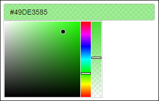

# {colourpicker} - A Colour Picker Tool for Shiny and for Selecting Colours in Plots


[](https://github.com/daattali/colourpicker/actions) [](https://cran.r-project.org/package=colourpicker)

> [Demo](https://daattali.com/shiny/colourInput/) &middot; Created by [Dean Attali](https://deanattali.com)

{colourpicker} gives you a colour picker widget that can be used in different contexts in R.



The most common uses of {colourpicker} are to use the `colourInput()` function to create a [colour input in Shiny](https://daattali.com/shiny/colourInput/), or to use the `plotHelper()` function/RStudio Addin to easily [select colours for a plot](inst/img/plothelper-demo.gif).

**Need Shiny help? [I'm available for consulting](https://attalitech.com/).**<br/>
**If you find {colourpicker} useful, please consider [supporting my work](https://github.com/sponsors/daattali) to unlock rewards\! ❤**

<p align="center">

<a style="display: inline-block;" href="https://github.com/sponsors/daattali">
 </a>

<a style="display: inline-block;" href="https://paypal.me/daattali">

</a>

</p>

> This package is part of a larger ecosystem of packages with a shared vision: solving common Shiny issues and improving Shiny apps with minimal effort, minimal code changes, and straightforward documentation. Other packages for your Shiny apps:

| Package | Description | Demo |
|---|---|---|
| [shinyjs](https://deanattali.com/shinyjs/) | 💡 Easily improve the user experience of your Shiny apps in seconds | [🔗](https://deanattali.com/shinyjs/overview#demo) |
| [shinyalert](https://github.com/daattali/shinyalert) | 🗯️ Easily create pretty popup messages (modals) in Shiny | [🔗](https://daattali.com/shiny/shinyalert-demo/) |
| [shinyscreenshot](https://github.com/daattali/shinyscreenshot/) | 📷 Capture screenshots of entire pages or parts of pages in Shiny apps | [🔗](https://daattali.com/shiny/shinyscreenshot-demo/) |
| [timevis](https://github.com/daattali/timevis/) | 📅 Create interactive timeline visualizations in R | [🔗](https://daattali.com/shiny/timevis-demo/) |
| [shinycssloaders](https://github.com/daattali/shinycssloaders/) | ⌛ Add loading animations to a Shiny output while it's recalculating | [🔗](https://daattali.com/shiny/shinycssloaders-demo/) |
| [shinybrowser](https://github.com/daattali/shinybrowser/) | 🌐 Find out information about a user's web browser in Shiny apps | [🔗](https://daattali.com/shiny/shinybrowser-demo/) |
| [shinydisconnect](https://github.com/daattali/shinydisconnect/) | 🔌 Show a nice message when a Shiny app disconnects or errors | [🔗](https://daattali.com/shiny/shinydisconnect-demo/) |
| [shinyforms](https://github.com/daattali/shinyforms/) | 📝 Easily create questionnaire-type forms with Shiny | WIP |


# Table of contents

- [Demos](#demos)
- [Sponsors 🏆](#sponsors)
- [Installation](#install)
- [Colour input for Shiny apps (or R markdown): `colourInput()`](#colourinput)
- [Select colours to use in your plot: `plotHelper()`](#plothelper)
- [Select colours to use in your R code: `colourPicker()`](#colourpicker)
- [Features of `colourInput()`](#colourinput-features)
- [Features of `plotHelper()`](#plothelper-features)

<h2 id="demos">Demos</h2>

As mentioned above, the most useful functions are `colourInput()` and `plotHelper()`.

  - [Click here](https://daattali.com/shiny/colourInput/) to view a live
interactive demo the colour input.
  - The GIF below shows what the Plot Colour Helper looks like (the GIF is from an old version that did not support opacity/transparency for colours, which is now supported).


<h2 id="sponsors">Sponsors 🏆</h2>

- [Thomas Carmichael](https://github.com/tommykins)

[Become a sponsor for {colourpicker} and unlock special rewards!](https://github.com/sponsors/daattali/sponsorships?tier_id=39856)

<h2 id="install">Installation</h2>

To install the stable CRAN version:

```
install.packages("colourpicker")
```

To install the latest development version from GitHub:

```
install.packages("remotes")
remotes::install_github("daattali/colourpicker")
```

<h2 id="colourinput">Colour input for Shiny apps (or R markdown): `colourInput()`</h2>

You can use `colourInput()` to include a colour picker input in Shiny apps (or in R markdown documents). It works just like any other native Shiny input:

```
library(shiny)
shinyApp(
    ui = fluidPage(
        colourInput("col", "Select colour", "purple"),
        plotOutput("plot")
    ),
    server = function(input, output) {
        output$plot <- renderPlot({
            set.seed(1)
            plot(rnorm(50), bg = input$col, col = input$col, pch = 21)
        })
    }
)
```


Scroll down for [more information about `colourInput()`](#colourinput-features).

<h2 id="plothelper">Select colours to use in your plot: `plotHelper()`</h2>

If you've ever had to spend a long time perfecting the colour scheme of a plot, you'd find the Plot Colour Helper handy. It's an RStudio addin that lets you interactively choose colours for your plot while updating your plot in real-time, so you can see the colour changes immediately.

To use this tool, either highlight code for a plot and select the addin through the RStudio *Addins* menu, or call the `plotHelper()` function. The colours selected will be available as a variable named `CPCOLS`.


Scroll down for [more information about the Plot Colour Helper](#plothelper-features).

<h2 id="colourpicker">Select colours to use in your R code: `colourPicker()`</h2>

{colourpicker} also provides a more generic RStudio addin that can be used to select colours and save them as a variable in R. You can either access this tool using the *Addins* menu or with `colourPicker()`. You can also watch a [short GIF](inst/img/colourPickerGadget.gif) of it an action.


## Colour input as an 'htmlwidgets' widget

The colour picker input is also available as an 'htmlwidgets' widget using the `colourWidget()` function. This may not be terribly useful right now since you can use the more powerful `colourInput` in Shiny apps and Rmarkdown documents, but it may come in handy if you need a widget. 

<h2 id="colourinput-features">Features of 'colourInput()'</h2>
<div></div>

### Simple and familiar

Using `colourInput` is extremely trivial if you've used Shiny, and it's as easy to use as any other input control.  It was implemented to very closely mimic all other Shiny inputs so that using it will feel very familiar. You can add a simple colour input to your Shiny app with `colourInput("col", "Select colour", value = "red")`. The return value from a `colourInput` is an uppercase HEX colour, so in the previous example the value of `input$col` would be `#FF0000` (#FF0000 is the HEX value of the colour red). The default value at initialization is white (#FFFFFF).

### Retrieving the colour names

If you use the `returnName = TRUE` parameter, then the return value will be a colour name instead of a HEX value, when possible. For example, if the chosen colour is red, the return value will be `red` instead of `#FF0000`. For any colour that does not have a standard name, its HEX value will be returned.

### Allowing transparent colours

A simple colour input allows you to choose any opaque colour. If you use the `allowTransparent = TRUE` parameter, the input will display an additional slider that lets you choose a transparency (alpha) value. Using this slider allows you to select semi-transparent colours, or even the fully transparent colour, which is sometimes useful.

When using transparent colours, the return value will be an 8-digit HEX code instead of 6 digits (the last 2 digits are the transparency value). For example, if you select a 50% transparent red, the return value would be `#FF000080`. Most R plotting functions can accept colours in this format.

### Limited colour selection

If you want to only allow the user to select a colour from a specific list of colours, rather than any possible colour, you can use the `palette = "limited"` parameter.  By default, the limited palette will contain 40 common colours, but you can supply your own list of colours using the `allowedCols` parameter. Here is an image of the default `limited` colour palette.


### Flexible colour specification

Specifying a colour to the colour input is very flexible to allow for easier use. When providing a colour as the `value` parameter of the input, there are a few ways to specify a colour:

- Using a name of an R colour, such as `red`, `gold`, `blue3`, or any other name that R supports (for a full list of R colours, type `colours()`)
- Using a 6-character HEX value, either with or without the leading `#`. For example, initializing a `colourInput` with any of the following values will all result in the colour red: `ff0000`, `FF0000`, `#ff0000`. If transparency is allowed, you can use an 8-character HEX value.
- Using a 3-character HEX value, either with or without the leading `#`. These values will be converted to full HEX values by automatically doubling every character. For example, all the following values would result in the same colour: `1ac`, `#1Ac`, `11aacc`. If transparency is allowed, you can use a 4-character HEX value.
- Using RGB specification, such as `rgb(0, 0, 255)`. If transparency is allowed, you can use an `rgba()` specification.
- Using HSL specification, such as `hsl(240, 100, 50)`. If transparency is allowed, you can use an `hsla()` specification.

**Protip:** You can also type in any of these values directly into the input box to select that colour, instead of selecting it from the colour palette with your mouse. For example, you can click on the colour input and literally type the word "blue", and the colour blue will get selected.

### How the chosen colour is shown inside the input box

By default, the colour input's background will match the selected colour and the text inside the input field will be the colour's HEX value. If that's too much for you, you can customize the input with the `showColour` parameter to either only show the text or only show the background colour.

Here is what a colour input with each of the possible values for `showColour` looks like


### Updating a colourInput

As with all other Shiny inputs, `colourInput` can be updated with the `updateColourInput` function.  Any parameter that can be used in `colourInput` can be used in `updateColourInput`. This means that you can start with a basic colour input such as `colourInput("col", "Select colour")` and completely redesign it with

```
updateColourInput(session, "col", label = "COLOUR:", value = "orange",
  showColour = "background", allowTransparent = TRUE)
```

### Works on any device

If you're worried that maybe someone viewing your Shiny app on a phone won't be able to use this input properly - don't you worry. I haven't quite checked every single device out there, but I did spend extra time making sure the colour selection JavaScript works in most devices I could think of. `colourInput` will work fine in Shiny apps that are viewed on Android cell phones, iPhones, iPads, and even Internet Explorer 8+.

<h2 id="plothelper-features">Features of 'plotHelper()'</h2>
<div></div>

### Addin vs gadget

The Plot Colour Helper is available as both a gadget and an RStudio addin. This means that it can be invoked in one of two ways:

- Highlight code for a plot and select the addin through the *Addins* menu, or
- Call the `plotHelper(code)` function with plot code as the first parameter.

There is a small difference between the two: invoking the addin via `plotHelper()` will merely return the final colour list as a vector, while using the *Addins* menu will result in the entire plot code and colour list getting inserted into the document.

### Most important to understand: Use `CPCOLS` in your plot code

The Plot Colour Helper lets you run code for a plot, and select a list of colours. But how does the list of colours get linked to the plot? The colour list is available as a variable called `CPCOLS`. This means that in order to refer to the colour list, you need to use that variable in your plot code. You can even refer to it more than once if you want to select colours for multiple purposes in the plot:

```
plotHelper(ggplot(iris, aes(Sepal.Length, Petal.Length)) +
    geom_point(aes(col = Species)) +
    scale_colour_manual(values = CPCOLS[1:3]) +
    theme(panel.background = element_rect(CPCOLS[4])),
    colours = 4)
```

### Default plot if no code is provided

To more easily access the tool, you can call `plotHelper()` with no parameters or select the addin without highlighting any code. In that case, the default code in the tool will be initialized as

```
ggplot(iris, aes(Sepal.Length, Petal.Length)) +
      geom_point(aes(col = Species)) +
      scale_colour_manual(values = CPCOLS)
```

You can always change the plot code from within the tool.

### Initial list of colours

You can set the initial colour list by providing a vector of colours as the `colours` parameter to `plotHelper()` (eg. `plotHelper(colours = c("red", "#123ABC"))`).

Alternatively, if you don't want to initialize to any particular set of colours, but you want to initialize with a specific number of colours in the list, you can provide an integer as the `colours` parameter (eg. `plotHelper(colours = 2)`).

If the colour values are not provided, then a default palette of colours will be used for the initial colours. This palette has 12 colours, and if there are more than 12 colours to support then they will get recycled.

### Plot Colour Helper tries to guess how many colours are needed

If you don't provide the `colours` parameter, or if you invoke the tool as an addin, it will attempt to guess how many colours are needed. For example, using the following plot code

```
ggplot(mtcars, aes(wt, mpg)) +
    geom_point(aes(col = as.factor(am))) +
    scale_colour_manual(values = CPCOLS)
```

will initialize the tool with 2 colours (because there are 2 `am` levels), while the following code

```
ggplot(mtcars, aes(wt, mpg)) +
    geom_point(aes(col = as.factor(cyl))) +
    scale_colour_manual(values = CPCOLS)
```

will use 3 colours.

### Keyboard shortcuts

There are several keyboard shortcuts available, to make the selection process even simpler. **Spacebar** to add another colour, **Delete** to remove the currently selected colour, **Left**/**Right** to navigate the colours, and more. You can view the full list of shortcuts by clicking on *Show keyboard shortcuts*.

### Return value of Plot Colour Helper

When the tool is run as an addin, the final colour list and the code get inserted into the currently selected RStudio document (either the Source panel or the Console panel).

If the tool is called with `plotHelper()`, then the return value is simply the vector of selected colours. You can assign it into a variable directly - running `cols <- plotHelper()` will assign the selected colours into `cols`.

Since the plot code requires you to use the variable name `CPCOLS`, after closing the plot helper tool, a variable named `CPCOLS` will be available in the global environment.

The colours returned can either be in HEX format (eg. "#0000FF") or be named (eg. "blue") - you can choose this option inside the tool.
