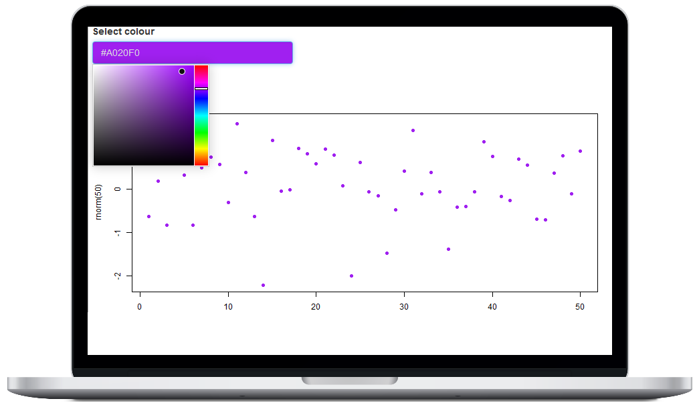
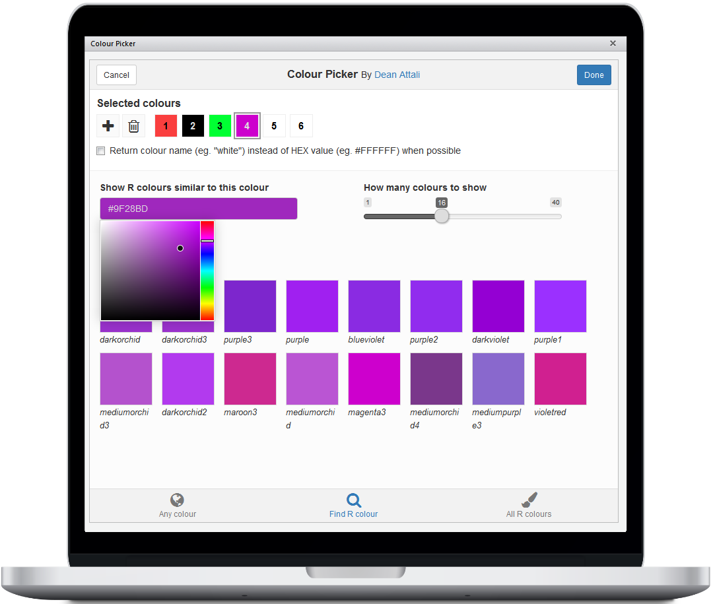
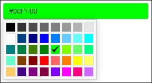

colourpicker - A Colour Picker Widget for Shiny Apps, RStudio, R-markdown, and 'htmlwidgets'
============================================================================================

> *Copyright 2016 [Dean Attali](http://deanattali.com). Licensed under
> the MIT license.*

`colourpicker` gives you a colour picker widget that can be used in
different contexts in R. Most of the functionality here is taken from
straight from [`shinyjs`](https://github.com/daattali/shinyjs) in order
to make the colour picker a standalone package.

Demo
----

[Click here](http://daattali.com/shiny/colourInput/) to view a live
interactive demo of `colourpicker`.

Installation
------------

`colourpicker` is available through both CRAN and GitHub:

To install the stable CRAN version:

    install.packages("colourpicker")

To install the latest development version from GitHub:

    install.packages("devtools")
    devtools::install_github("daattali/colourpicker")

Overview of main functions
--------------------------

`colourpicker` exposes three functions: `colourInput()` (for Shiny
apps), `colourPicker()` (RStudio addin), and `colourWidget()` (an
htmlwidget).

### In Shiny apps (or R markdown): `colourInput()`

You can use `colourInput()` to include a colour picker input in Shiny
apps (or in R markdown documents). It works just like any other native
Shiny input, here is an example:

    library(shiny)
    shinyApp(
        ui = fluidPage(
            colourInput("col", "Select colour", "purple"),
            plotOutput("plot")
        ),
        server = function(input, output) {
            output$plot <- renderPlot({
                set.seed(1)
                plot(rnorm(50), bg = input$col, col = input$col, pch = 21)
            })
        }
    )

### To select colours to use in your R code: `colourPicker()`

`colourpicker` also provides an RStudio addin that can be used to easily
select colours and save them as a variable in R. This can be useful if,
for example, you want to pick some colours for a plot and you want an
easy way to visualize and select a few colours. Here is a screenshot of
the colour picker addin (you can either access this tool using the
Addins menu or with `colourPicker()`). You can also watch a [short
GIF](inst/img/colourPickerGadget.gif) of it an action.

### As an 'htmlwidgets' widget

The colour picker input is also available as an 'htmlwidgets' widget
using the `colourWidget()` function. This may not be terribly useful
right now since you can use the more powerful `colourInput` in Shiny
apps and Rmarkdown documents, but it may come in handy if you need a
widget.

Features of `colourInput()`
---------------------------

### Simple and familiar

Using `colourInput` is extremely trivial if you've used Shiny, and it's
as easy to use as any other input control. It was implemented to very
closely mimic all other Shiny inputs so that using it will feel very
familiar. You can add a simple colour input to your Shiny app with
`colourInput("col", "Select colour", value = "red")`. The return value
from a `colourInput` is an uppercase HEX colour, so in the previous
example the value of `input$col` would be `#FF0000` (\#FF0000 is the HEX
value of the colour red). The default value at initialization is white
(\#FFFFFF).

### Allowing "transparent"

Since most functions in R that accept colours can also accept the value
"transparent", `colourInput` has an option to allow selecting the
"transparent" colour. By default, only real colours can be selected, so
you need to use the `allowTransparent = TRUE` parameter. When this
feature is turned on, a checkbox appears inside the input box.

If the user checks the checkbox for "transparent", then the colour input
is grayed out and the returned value of the input is `transparent`. This
is the only case when the value returned from a `colourInput` is not a
HEX value. When the checkbox is unchecked, the value of the input will
be the last selected colour prior to selecting "transparent".

By default, the text of the checkbox reads "Transparent", but you can
change that with the `transparentText` parameter. For example, it might
be more clear to a user to use the word "None" instead of "Transparent".
Note that even if you change the checkbox text, the return value will
still be `transparent` since that's the actual colour name in R.

This is what a colour input with transparency enabled looks like

\[

### How the chosen colour is shown inside the input

By default, the colour input's background will match the selected colour
and the text inside the input field will be the colour's HEX value. If
that's too much for you, you can customize the input with the
`showColour` parameter to either only show the text or only show the
background colour.

Here is what a colour input with each of the possible values for
`showColour` looks like

\[

### Updating a colourInput

As with all other Shiny inputs, `colourInput` can be updated with the
`updateColourInput` function. Any parameter that can be used in
`colourInput` can be used in `updateColourInput`. This means that you
can start with a basic colour input such as
`colourInput("col", "Select colour")` and completely redesign it with

    updateColourInput(session, "col", label = "COLOUR:", value = "orange",
      showColour = "background", allowTransparent = TRUE, transparentText = "None")

### Limited colour selection

This feature is available in `shinyjs` v0.0.8.0, which is currently only
on GitHub and not on CRAN.

If you want to only allow the user to select a colour from a specific
list of colours, rather than any possible HEX colour, you can use the
`palette = "limited"` parameter. By default, the limited palette will
contain 40 common colours, but you can supply your own list of colours
using the `allowedCols` parameter. Here is an image of the default
limited colour palette.

\[

### Flexible colour specification

Specifying a colour to the colour input is made very flexible to allow
for easier use. When giving a colour as the `value` parameter of either
`colourInput` or `updateColourInput`, there are a few ways to specify a
colour:

-   Using a name of an R colour, such as `red`, `gold`, `blue3`, or any
    other name that R supports (for a full list of R colours, type
    `colours()`)
-   If transparency is allowed in the `colourInput`, the value
    `transparent` (lowercase) can be used. This will update the UI to
    check the checkbox.
-   Using a 6-character HEX value, either with or without the leading
    `#`. For example, initializing a `colourInput` with any of the
    following values will all result in the colour red: `ff0000`,
    `FF0000`, `#ff0000`.
-   Using a 3-character HEX value, either with or without the leading
    `#`. These values will be converted to full HEX values by
    automatically doubling every character. For example, all the
    following values would result in the same colour: `1ac`, `#1Ac`,
    `11aacc`.

### Works on any device

If you're worried that maybe someone viewing your Shiny app on a phone
won't be able to use this input properly - don't you worry. I haven't
quite checked every single device out there, but I did spend extra time
making sure the colour selection JavaScript works in most devices I
could think of. `colourInput` will work fine in Shiny apps that are
viewed on Android cell phones, iPhones, iPads, and even Internet
Explorer 8+.
