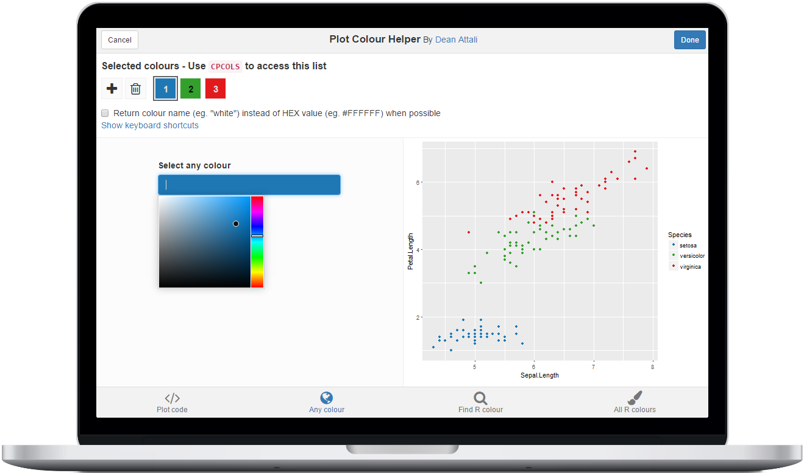

```{r setup, echo = FALSE, message = FALSE}
knitr::opts_chunk$set(tidy = FALSE, comment = "#>")
```


# colourpicker - A Colour Picker Tool for Shiny and for Selecting Colours in Plots

[](https://travis-ci.org/daattali/colourpicker) [](https://cran.r-project.org/package=colourpicker)

> *Copyright 2016 [Dean Attali](http://deanattali.com). Licensed under the MIT license.*

`colourpicker` gives you a colour picker widget that can be used in different contexts in R.

The most common uses of `colourpicker` are to use the `colourInput()` function to create a colour input, or to use the `plotHelper()` function/RStudio Addin to easily select colours to use in a plot.

# Table of contents

- [Demos](#demos)
- [Installation](#install)
- [Colour input for Shiny apps (or R markdown): `colourInput()`](#colourinput)
- [Select colours to use in your plot: `plotHelper()`](#plothelper)
- [Select colours to use in your R code: `colourPicker()`](#colourpicker)
- [Features of `colourInput()`](#colourinput-features)
- [Features of `plotHelper()`](#plothelper-features)

<h2 id="demos">Demos</h2>

As mentioned above, the most useful functions are `colourInput()` and `plotHelper()`.

  - [Click here](http://daattali.com/shiny/colourInput/) to view a live
interactive demo the colour input.
  - The GIF below shows what the Plot Colour Helper looks like.


<h2 id="install">Installation</h2>

`colourpicker` is available through both CRAN and GitHub:

To install the stable CRAN version:

```
install.packages("colourpicker")
```

To install the latest development version from GitHub:

```
install.packages("devtools")
devtools::install_github("daattali/colourpicker")
```

<h2 id="colourinput">Colour input for Shiny apps (or R markdown): `colourInput()`</h2>

You can use `colourInput()` to include a colour picker input in Shiny apps (or in R markdown documents). It works just like any other native Shiny input, here is an example:

```
library(shiny)
shinyApp(
    ui = fluidPage(
        colourInput("col", "Select colour", "purple"),
        plotOutput("plot")
    ),
    server = function(input, output) {
        output$plot <- renderPlot({
            set.seed(1)
            plot(rnorm(50), bg = input$col, col = input$col, pch = 21)
        })
    }
)
```


<h2 id="plothelper">Select colours to use in your plot: `plotHelper()`</h2>

If you've ever had to spend a long time perfecting the colour scheme of a plot, you'd find the Plot Colour Helper handy. It's an RStudio addin that lets you interactively choose colours for your plot while updating your plot in real-time so you can see the colour changes immediately.

To use this tool, either highlight code for a plot and select the addin through the RStudio *Addins* menu, or call the `plotHelper()` function. The colours selected will be available as a variable named `CPCOLS`.



<h2 id="colourpicker">Select colours to use in your R code: `colourPicker()`</h2>

`colourpicker` also provides a more generic RStudio addin that can be used to select colours and save them as a variable in R. You can either access this tool using the *Addins* menu or with `colourPicker()`. You can also watch a [short GIF](../inst/img/colourPickerGadget.gif) of it an action.


## Colour input as an 'htmlwidgets' widget

The colour picker input is also available as an 'htmlwidgets' widget using the `colourWidget()` function. This may not be terribly useful right now since you can use the more powerful `colourInput` in Shiny apps and Rmarkdown documents, but it may come in handy if you need a widget. 

<h2 id="colourinput-features">Features of `colourInput()`</h2>

### Simple and familiar

Using `colourInput` is extremely trivial if you've used Shiny, and it's as easy to use as any other input control.  It was implemented to very closely mimic all other Shiny inputs so that using it will feel very familiar. You can add a simple colour input to your Shiny app with `colourInput("col", "Select colour", value = "red")`. The return value from a `colourInput` is an uppercase HEX colour, so in the previous example the value of `input$col` would be `#FF0000` (#FF0000 is the HEX value of the colour red). The default value at initialization is white (#FFFFFF).

### Allowing "transparent"

Since most functions in R that accept colours can also accept the value "transparent", `colourInput` has an option to allow selecting the "transparent" colour. By default, only real colours can be selected, so you need to use the `allowTransparent = TRUE` parameter. When this feature is turned on, a checkbox appears inside the input box.

If the user checks the checkbox for "transparent", then the colour input is grayed out and the returned value of the input is `transparent`. This is the only case when the value returned from a `colourInput` is not a HEX value. When the checkbox is unchecked, the value of the input will be the last selected colour prior to selecting "transparent".

By default, the text of the checkbox reads "Transparent", but you can change that with the `transparentText` parameter. For example, it might be more clear to a user to use the word "None" instead of "Transparent". Note that even if you change the checkbox text, the return value will still be `transparent` since that's the actual colour name in R.

This is what a colour input with transparency enabled looks like


### How the chosen colour is shown inside the input

By default, the colour input's background will match the selected colour and the text inside the input field will be the colour's HEX value. If that's too much for you, you can customize the input with the `showColour` parameter to either only show the text or only show the background colour.

Here is what a colour input with each of the possible values for `showColour` looks like


### Updating a colourInput

As with all other Shiny inputs, `colourInput` can be updated with the `updateColourInput` function.  Any parameter that can be used in `colourInput` can be used in `updateColourInput`. This means that you can start with a basic colour input such as `colourInput("col", "Select colour")` and completely redesign it with

```
updateColourInput(session, "col", label = "COLOUR:", value = "orange",
  showColour = "background", allowTransparent = TRUE, transparentText = "None")
```

### Limited colour selection

This feature is available in `shinyjs` v0.0.8.0, which is currently only on GitHub and not on CRAN.

If you want to only allow the user to select a colour from a specific list of colours, rather than any possible HEX colour, you can use the `palette = "limited"` parameter.  By default, the limited palette will contain 40 common colours, but you can supply your own list of colours using the `allowedCols` parameter. Here is an image of the default limited colour palette.


### Flexible colour specification

Specifying a colour to the colour input is made very flexible to allow for easier use. When giving a colour as the `value` parameter of either `colourInput` or `updateColourInput`, there are a few ways to specify a colour:

- Using a name of an R colour, such as `red`, `gold`, `blue3`, or any other name that R supports (for a full list of R colours, type `colours()`)
- If transparency is allowed in the `colourInput`, the value `transparent` (lowercase) can be used. This will update the UI to check the checkbox.
- Using a 6-character HEX value, either with or without the leading `#`.  For example, initializing a `colourInput` with any of the following values will all result in the colour red: `ff0000`, `FF0000`, `#ff0000`.
- Using a 3-character HEX value, either with or without the leading `#`. These values will be converted to full HEX values by automatically doubling every character. For example, all the following values would result in the same colour: `1ac`, `#1Ac`, `11aacc`.

### Works on any device

If you're worried that maybe someone viewing your Shiny app on a phone won't be able to use this input properly - don't you worry. I haven't quite checked every single device out there, but I did spend extra time making sure the colour selection JavaScript works in most devices I could think of. `colourInput` will work fine in Shiny apps that are viewed on Android cell phones, iPhones, iPads, and even Internet Explorer 8+.

<h2 id="plothelper-features">Features of `plotHelper()`</h2>

### Addin vs gadget

The Plot Colour Helper is available as both a gadget and an RStudio addin. This means that it can be invoked in one of two ways:

- Highlight code for a plot and select the addin through the *Addins* menu, or
- Call the `plotHelper(code)` function with plot code as the first parameter.

There is a small difference between the two: invoking the addin via `plotHelper()` will merely return the final colour list as a vector, while using the *Addins* menu will result in the entire plot code and colour list getting inserted into the document.

### Most important to understand: Use `CPCOLS` in your plot code

The Plot Colour Helper lets you run code for a plot, and select a list of colours. But how does the list of colours get linked to the plot? The colour list is available as a variable called `CPCOLS`. This means that in order to refer to the colour list, you need to use that variable in your plot code. You can even refer to it more than once if you want to select colours for multiple purposes in the plot:

```
plotHelper(ggplot(iris, aes(Sepal.Length, Petal.Length)) +
    geom_point(aes(col = Species)) +
    scale_colour_manual(values = CPCOLS[1:3]) +
    theme(panel.background = element_rect(CPCOLS[4])),
    colours = 4)
```

### Default plot if no code is provided

To more easily access the tool, you can call `plotHelper()` with no parameters or select the addin without highlighting any code. In that case, the default code in the tool will be initialized as

```
ggplot(iris, aes(Sepal.Length, Petal.Length)) +
      geom_point(aes(col = Species)) +
      scale_colour_manual(values = CPCOLS)
```

You can always change the plot code from within the tool.

### Initial list of colours

You can set the initial colour list by providing a vector of colours as the `colours` parameter to `plotHelper()` (eg. `plotHelper(colours = c("red", "#123ABC"))`).

Alternatively, if you don't want to initialize to any particular set of colours, but you want to initialize with a specific number of colours in the list, you can provide an integer as the `colours` parameter (eg. `plotHelper(colours = 2)`).

If the colour values are not provided, then a default palette of colours will be used for the initial colours. This palette has 12 colours, and if there are more than 12 colours to support then they will get recycled.

### Plot Colour Helper tries to guess how many colours are needed

If you don't provide the `colours` parameter, or if you invoke the tool as an addin, it will attempt to guess how many colours are needed. For example, using the following plot code

```
ggplot(mtcars, aes(wt, mpg)) +
    geom_point(aes(col = as.factor(am))) +
    scale_colour_manual(values = CPCOLS)
```

will initialize the tool with 2 colours (because there are 2 `am` levels), while the following code

```
ggplot(mtcars, aes(wt, mpg)) +
    geom_point(aes(col = as.factor(cyl))) +
    scale_colour_manual(values = CPCOLS)
```

will use 3 colours.

### Keyboard shortcuts

There are several keyboard shortcuts available, to make the selection process even simpler. **Spacebar** to add another colour, **Delete** to remove the currently selected colour, **Left**/**Right** to navigate the colours, and more. You can view the full list of shortcuts by clicking on *Show keyboard shortcuts*.

### Return value of Plot Colour Helper

When the tool is run as an addin, the final colour list and the code get inserted into the currently selected RStudio document (either the Source panel or the Console panel).

If the tool is called with `plotHelper()`, then the return value is simply the vector of selected colours. You can assign it into a variable directly - running `cols <- plotHelper()` will assign the selected colours into `cols`.

Since the plot code requires you to use the variable name `CPCOLS`, after closing the plot helper tool, a variable named `CPCOLS` will be available in the global environment.

The colours returned can either be in HEX format (eg. "#0000FF") or be named (eg. "blue") - you can choose this option inside the tool.
